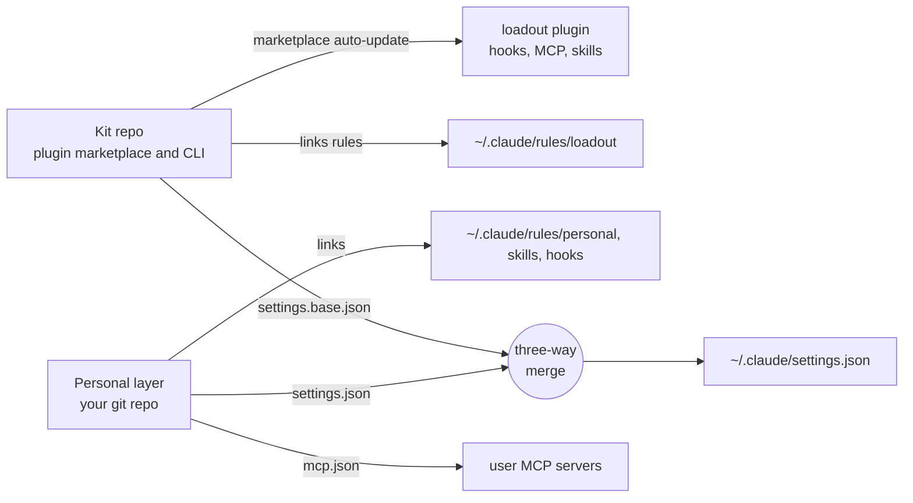
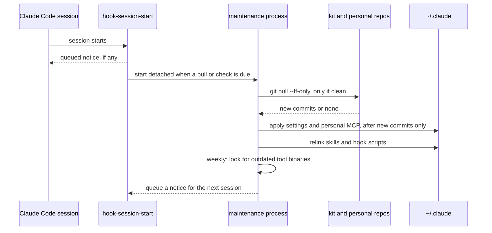

# Architecture

loadout has three parts: the kit repo (shared), your personal layer (yours) and `~/.claude` (where Claude Code reads its configuration). The CLI merges the first two into the third and keeps it current.

## The parts

**The kit repo** (this repository) holds what is the same for everybody:

- `plugins/loadout/`: the plugin with hooks, two MCP servers (Serena and codebase-memory) and the skills. The repo is also a plugin marketplace, so Claude Code installs and updates the plugin itself.
- `rules/`: how Claude should use the tools. `~/.claude/rules/loadout` is a link to this folder.
- `catalog.json`: what is good, superseded or optional, and how to install and update each tool. See [Catalog format](../reference/catalog-format.md).
- `profiles/`: per-project add-ons. See [Profile format](../reference/profile-format.md).
- `settings.base.json` and `preferences.json`: the settings loadout manages and the working preferences it asks about.
- `cli/loadout/`: the CLI, Python standard library only. See the [CLI reference](../reference/cli.md).

**The personal layer** (`~/.config/loadout/personal`, ideally a private git repo) holds what is yours: `rules/me.md`, `settings.json` overrides, `mcp.json`, your skills, hooks and profiles. It is linked into `~/.claude/rules/personal`, `~/.claude/skills` and `~/.claude/hooks/personal`. See [Personal layer](../reference/personal-layer.md).

**`~/.claude`** is owned by Claude Code and by you. loadout adds links and merges its own keys into `settings.json`. It does not edit `~/.claude/CLAUDE.md`. Your other settings stay.

**Machine-local state** (`~/.claude/.loadout/`) records what the merge last applied, your `leave` decisions and the maintenance timestamps. It is not synced.

## The settings merge

The merge combines the kit's `settings.base.json`, your personal `settings.json` and the snapshot of what was applied last time. Because it has the snapshot, it can tell a value you changed from a value the kit changed, and it can tell a hook you deleted from a hook it never added. The kit manages only the keys it declares, so everything else in your `settings.json` survives. The exact rules, including the per-hook merge, are in [Settings merge](../reference/settings-merge.md).

## The daily sync

At each session start the plugin runs `loadout hook-session-start`. It prints queued notices and, when the daily pull or the weekly check is due, starts `loadout maintenance` as a detached process. The session never waits for it.

Details, from `maintenance._maintain`:

- One maintenance run at a time: a lock file in the state folder, taken over only after an hour.
- The pull is skipped for a checkout with uncommitted changes, and everything is skipped with `LOADOUT_NO_AUTO_PULL=1`.
- Settings, MCP and links are re-applied only when a pull brought new commits. Errors become a notice for the next session instead of a crash.
- The weekly check compares installed and latest versions (through mise when it manages the tool, so its pins and release-age rules count). It queues "updates available, run `loadout update`". It never installs.

Plugins are not part of this loop: Claude Code updates them through the marketplace.

## Why it is built this way

The main decisions, in short. Each has a decision record with the alternatives that were considered.

- **A kit and a personal repo.** The shared part can be updated for everybody while your own part stays yours and syncs through your own git. Without the split, either every user forks the kit or personal settings leak into it.
- **The kit is a plugin marketplace.** Claude Code already knows how to install, enable and update plugins. loadout reuses that instead of copying files into `~/.claude` itself.
- **Three-way settings merge.** A plain overwrite would destroy your own settings. A plain merge cannot tell whether you or the kit changed a value. The snapshot makes both safe and lets you delete a kit hook without it coming back.
- **Rules are linked as folders.** Linking `rules/` leaves `~/.claude/CLAUDE.md` yours, and a pull updates the rules without touching a file you own.

See the decision records for these and for the others (catalog, secrets, scoping, backups, hook merging).

## Other agents (planned)

This is planned and not implemented: loadout today configures Claude Code only. The catalog, the rules (plain Markdown), `AGENTS.md` and `docs/`, Serena and codebase-memory (MCP servers) and the skills are already agent-neutral. The Claude-specific parts are settings, plugins and the marketplace, hooks and MCP registration. A later version is meant to add targets, for example Codex (MCP servers in `~/.codex/config.toml`, global rules in `AGENTS.md`, a skills directory) and possibly Gemini CLI or Cursor. Each target would map the same personal layer and catalog to that agent's configuration. To keep this cheap, the Claude-specific code sits in `settings_merge`, `bootstrap.setup_plugins`, `adopt._apply_*` and `link`, so it can later move behind a target interface. The source is section 14 of the [original design](../superpowers/specs/2026-10-08-agent-loadout-design.md).
