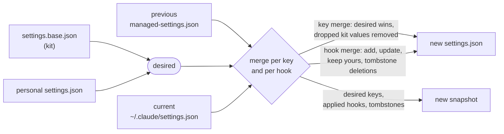

# Settings merge

`loadout apply-settings` merges the kit's settings and your personal settings into `~/.claude/settings.json`. Bootstrap, `loadout configure` and the daily maintenance run the same merge. The code and its docstrings are in `cli/loadout/settings_merge.py`.

The merge uses three inputs:

| Input | Is |
|---|---|
| desired | `settings.base.json` from the kit, overlaid with `<personal>/settings.json`. Dicts merge recursively, lists are joined without duplicates, and for any other value your personal file wins. |
| previous | The snapshot `~/.claude/.loadout/managed-settings.json`: what the merge applied last time. |
| current | Your `~/.claude/settings.json` as it is now. |

The result is written to `settings.json` only if it differs from current. The snapshot is rewritten on every run. If `settings.json` or the snapshot is not valid JSON, the run stops with an error before anything is written.

Everything in current that loadout never applied stays as it is: loadout manages only its own keys. The `hooks` section is merged per hook, with its own rules. All other keys follow the key merge.

## Key merge

This covers every key except `hooks`.

1. Start from current and apply desired on top. Desired values win. A list is current's items plus the desired items that are not yet in it.
2. For each value in previous that current still has, check whether the kit has stopped wanting it:
   - A value that is not a list: if desired no longer has the key and current still holds exactly the value the kit applied, the key is removed. If you changed the value, it stays.
   - A list: items the kit applied but no longer wants are removed from current's list. Items you added are kept. If the list ends up empty and desired no longer has the key, the key is removed.
   - A parent object that becomes empty is removed with it.
3. The new snapshot is desired without `hooks`.

Consequences:

- A value that desired sets is always set. If you change a kit-managed value in `settings.json`, the next merge puts it back, and `loadout check` warns about "settings drift" until then. To keep your value, put it in your personal `settings.json`.
- Something you added that the kit never applied is never removed.
- When a value leaves the personal layer or the kit, it leaves `settings.json` on the next merge, unless you changed it.

`loadout check` reports drift for the non-hook keys whose desired value is not present in current, and for each hook event whose merged value would differ from current.

## Hook merge

The `hooks` section is merged one hook at a time, not per group or per list. This is so that you can keep your own hooks in the same event and group, and so that two machines can have different hooks.

### Identity

A hook's identity is its event, its matcher, and its command:

- A missing matcher, `null` and `""` are the same matcher. A matcher that is not a string counts as its JSON text.
- A hook in exec form (it has `args`) is identified by its command plus the `args` list.
- A hook whose command is not a string is identified by its whole JSON object.

The group's other fields (anything besides `matcher` and `hooks`) are copied when loadout has to create a group, but they are not part of the identity.

Two entries in desired with the same identity count once; the last one wins.

### Rules

For each identity that is desired:

| Situation | Result |
|---|---|
| In desired, not in current, never applied | Added to the first group in current with the same event and matcher, or as a new group with the desired group's other fields. Recorded in the snapshot as applied. |
| In desired and in current, applied before and unchanged | The hook is loadout's. If the desired hook changed (a new `timeout`, say), it is updated in place, wherever it sits. With several equal copies, the one equal to the applied hook is loadout's. |
| In desired and in current, applied before, but you edited it | It is yours from now on. loadout does not update or remove it, and drops it from the snapshot. An edit that makes it equal to desired counts as in sync, not as yours. |
| In desired and in current, never applied | Your own copy (added by hand, or loadout applied it on another machine). It is left alone, not recorded, and a later removal from the personal layer keeps it. It is never added a second time. |
| In desired, not in current, applied before | You deleted it. It is not added back, and a tombstone is recorded under `loadoutDeletedHooks` in the snapshot. |
| In desired, with a tombstone | Never added again, also after a later change in the personal layer. A copy you add by hand later is yours. The tombstone stays as long as the hook stays desired. |

For each identity that was applied before and is no longer desired:

| Situation | Result |
|---|---|
| Still in current, unchanged | Removed. A group left empty is removed, and so is an event left empty. |
| Still in current, changed by you | Stays. It is yours. |
| Had a tombstone | The tombstone is forgotten. If the hook comes back to the personal layer later, it is added again. |

Changing the matcher of an applied hook changes its identity. Under the rules it counts as deleting the applied hook and adding your own.

Hooks that are in neither desired nor the snapshot are never touched.

### Values that are left alone

- If `hooks` in current is not an object, it is left exactly as it is.
- If an event in current is not a list, that event is left as it is. Its applied hooks and tombstones stay in the snapshot unchanged.
- Groups or hooks that are not objects are skipped.

### The snapshot

The snapshot has the desired non-hook keys. Under `hooks` it holds exactly the hooks that loadout applied, grouped by event and by the group's other fields. Under `loadoutDeletedHooks` it holds the tombstones in the same layout. It never holds your own copies.

`loadout adopt` writes to the snapshot too. When you record a hook as `global`, adopt replaces exactly that hook in `settings.json`, in its place, with the recorded version, and marks it as applied. A remembered deletion of that hook is cleared. A later removal from the personal layer then removes it on this machine too. Other copies with the same identity are dropped. The same command under another matcher is another hook and stays. Duplicates elsewhere in `settings.json` are not cleaned up.

## Limits

Which runs of the merge make a backup, and what restoring an older backup does to the snapshot: [Undo what loadout changed](../how-to/undo-and-restore.md#what-restore-does-not-undo).
