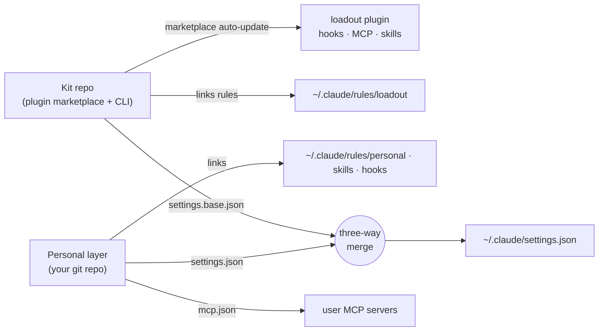

# Repo polish A — docs and repo content — Implementation Plan

> **For agentic workers:** REQUIRED SUB-SKILL: Use superpowers:subagent-driven-development (recommended) or superpowers:executing-plans to implement this plan task-by-task. Steps use checkbox (`- [ ]`) syntax for tracking.

**Goal:** Restructure agent-loadout's documentation into a short README plus Diátaxis `docs/`, ADRs, AGENTS.md, CONTRIBUTING, SECURITY and Serena memories, without changing behaviour.

**Architecture:** Plain Markdown rendered by GitHub. Every README topic moves to exactly one home in `docs/`, and the README links to it. Automated tests guard links and the CLAUDE.md conventions. Each page is written against the code (file:symbol) and checked at the end by a sceptical-first-visitor review.

**Tech Stack:** Markdown, Mermaid (GitHub-rendered), pytest (stdlib only) for the static checks.

**Spec:** `docs/superpowers/specs/2026-10-10-repo-polish-design.md`

## Global Constraints

- No behaviour change: only `*.md`, file moves/renames, and `tests/test_repo_static.py`. Do not touch `cli/`, `plugins/loadout/hooks/`, `catalog.json`, `profiles/`, `settings.base.json` or `preferences.json`.
- `docs/superpowers/` stays in place (the superpowers skills and the execution advisor use it); only a README note is added there.
- One home per fact: every other page links to it instead of repeating it. Tutorials teach one path end to end, how-to pages solve one task, reference pages are complete and dry, explanation pages say why.
- Every factual claim must match the code. When writing it, check the file:symbol. If code and the current README disagree, the code wins: write what the code does, and list each such case in the task report.
- Tone: short, concrete sentences, the existing README voice, no marketing words ("powerful", "seamless", "blazing").
- WSL 2 is the recommended Windows setup for loadout. Native Windows is supported. Facts come from the Claude Code docs: sandbox only on WSL 2; WSL 1 has a native-binary bug; projects under `/mnt/c` are slow and search is incomplete; the Windows PATH leaks into WSL; native Windows hooks run via Git Bash and need forward-slash or quoted script paths. The WSL detection code comes in sub-project B, so the docs describe only what to do by hand and must not promise checks that do not exist yet.
- Commits: Conventional Commits (`docs: …`, `test: …`). Never a `Co-Authored-By` or any attribution trailer.
- Never touch the real `~/.claude`, `~/.claude.json` or `~/.config/loadout`. `loadout --help`, `loadout <cmd> --help`, `loadout check` and `loadout configure show/own` are read-only and allowed.
- Tests: `uv run --python 3.12 --with pytest pytest -q`. Validate: `claude plugin validate .` and `claude plugin validate plugins/loadout`.

## Review Focus

1. **A fact that silently lost its home.** Something the old README said (a flag, an exit code, a troubleshooting row, an FAQ answer) appears nowhere in the new docs. Pinned in Task 6: a coverage checklist that maps every old README heading and table row to its new home.
2. **A docs claim the code contradicts.** For example, a flag that does not exist, or a default that is wrong. Pinned in Task 2: the reference/cli.md flag tables are generated by reading `--help` and must match it; plus the final review.
3. **A broken relative link or anchor after the moves.** Pinned in Task 1: `test_relative_links_resolve`.
4. **A nested CLAUDE.md leaking the example into kit sessions.** Pinned in Task 1: `test_no_nested_claude_md`.
5. **A WSL user following native-Windows instructions** (Git Bash, PowerShell profile). Pinned in Task 4: the tutorial's Windows section starts with the WSL/native choice and keeps the steps for each path apart.

---

## File structure

| File | Responsibility |
|---|---|
| `tests/test_repo_static.py` | + link check, no nested CLAUDE.md, CLAUDE.md content |
| `docs/README.md` | index: which page answers which question |
| `docs/tutorials/getting-started.md` | install and first run, per platform |
| `docs/how-to/*.md` | one task per page |
| `docs/reference/*.md` | complete facts: CLI, file formats, personal layer, hooks, settings merge |
| `docs/explanation/*.md` | architecture, documentation strategy, security and trust, execution advisor |
| `docs/adr/README.md`, `docs/adr/00NN-*.md` | decisions |
| `docs/examples/docs-audit-before-after/` | from the docs branch |
| `docs/superpowers/README.md` | note: working documents |
| `README.md`, `CONTRIBUTING.md`, `SECURITY.md`, `AGENTS.md`, `CLAUDE.md` | root documents |
| `.serena/memories/*.md` | short notes with links |

---

### Task 1: Merge the docs branch, move files, add the static checks

**Files:**
- Merge: branch `docs/documentation-strategy` (worktree `~/Documents/Code/agent-loadout-wt-docs`)
- Move: `docs/documentation-strategy.md` → `docs/explanation/documentation-strategy.md`
- Rename: every `docs/examples/docs-audit-before-after/**/CLAUDE.md` → `CLAUDE.md.example`
- Create: `docs/superpowers/README.md`
- Modify: `tests/test_repo_static.py`

**Interfaces:**
- Produces: `docs/explanation/` and `docs/examples/`, plus three tests other tasks rely on: `test_relative_links_resolve`, `test_no_nested_claude_md`, `test_claude_md_imports_agents_md`.

- [ ] **Step 1: Write the static tests** (append to `tests/test_repo_static.py`):

```python
_LINK = re.compile(r"(?<!!)\[[^\]]*\]\(([^)\s]+)(?:\s+\"[^\"]*\")?\)")


def _tracked_markdown():
    out = subprocess.run(["git", "-C", str(ROOT), "ls-files", "*.md", "**/*.md"], capture_output=True, text=True, check=True)
    files = sorted({ROOT / f for f in out.stdout.split()})
    return [f for f in files if "docs/superpowers/" not in f.relative_to(ROOT).as_posix()]


def _anchors(path):
    """GitHub-style heading anchors of a Markdown file."""
    out = set()
    for line in path.read_text(encoding="utf-8").splitlines():
        m = re.match(r"#{1,6}\s+(.*)", line)
        if m:
            slug = re.sub(r"[^\w\- ]", "", m.group(1).strip().lower()).replace(" ", "-")
            out.add(slug)
    return out


def test_relative_links_resolve():
    broken = []
    for md in _tracked_markdown():
        text = re.sub(r"```.*?```", "", md.read_text(encoding="utf-8"), flags=re.S)  # ignore code blocks
        for target in _LINK.findall(text):
            if re.match(r"[a-z]+:", target) or target.startswith("#") and not target[1:]:
                continue
            path_part, _, anchor = target.partition("#")
            dest = (md.parent / path_part).resolve() if path_part else md
            if not dest.exists():
                broken.append(f"{md.relative_to(ROOT)} -> {target}")
            elif anchor and dest.suffix == ".md" and anchor.lower() not in _anchors(dest):
                broken.append(f"{md.relative_to(ROOT)} -> {target} (no such heading)")
    assert not broken, "\n".join(broken)


def test_no_nested_claude_md():
    out = subprocess.run(["git", "-C", str(ROOT), "ls-files"], capture_output=True, text=True, check=True)
    nested = [f for f in out.stdout.split() if f.endswith("CLAUDE.md") and f != "CLAUDE.md"]
    assert not nested, f"nested CLAUDE.md files are loaded by Claude Code; rename them CLAUDE.md.example: {nested}"


def test_claude_md_imports_agents_md():
    assert (ROOT / "CLAUDE.md").read_text(encoding="utf-8").strip() == "@AGENTS.md"
    assert (ROOT / "AGENTS.md").exists()
```

- [ ] **Step 2: Bring in the docs branch.** In the worktree: `git -C ~/Documents/Code/agent-loadout-wt-docs merge --no-edit main`. Resolve conflicts in favour of main's README; the branch's README row is re-done in Task 6. Then, in the main checkout on `docs/repo-polish`: `git merge --no-edit docs/documentation-strategy`.
- [ ] **Step 3: Move and rename**:

```bash
mkdir -p docs/explanation
git mv docs/documentation-strategy.md docs/explanation/documentation-strategy.md
for f in $(git ls-files 'docs/examples/**/CLAUDE.md'); do git mv "$f" "${f}.example"; done
```

  In `docs/examples/docs-audit-before-after/README.md`, add a short note: "The example's `CLAUDE.md` files are named `CLAUDE.md.example`. Claude Code loads nested `CLAUDE.md` files when it reads a folder, so real ones would leak the example into sessions in this repo." Fix every link in the moved strategy doc and the example: paths are now one level deeper.
- [ ] **Step 4: Write `docs/superpowers/README.md`.** Three sentences: these are working documents (design specs and implementation plans) written by the superpowers skills; user documentation starts at `docs/README.md`; decisions live in `docs/adr/`.
- [ ] **Step 5: Run the tests.** `uv run --python 3.12 --with pytest pytest -q tests/test_repo_static.py`. Expected: `test_relative_links_resolve` and `test_no_nested_claude_md` pass (fix any link they report). `test_claude_md_imports_agents_md` fails until Task 7, so mark it with `@pytest.mark.xfail(strict=True, reason="AGENTS.md arrives in Task 7")`. Task 7 removes that mark.
- [ ] **Step 6: Commit.** Two commits: the branch merge, then `docs: move the strategy doc and example under docs/, add static doc checks`.

### Task 2: Reference pages

**Files:** Create `docs/reference/cli.md`, `catalog-format.md`, `profile-format.md`, `preferences-format.md`, `personal-layer.md`, `hooks.md`, `settings-merge.md`.

**Interfaces:**
- Consumes: Task 1's link test.
- Produces: stable anchors that Tasks 3–6 link to. Each command in `cli.md` has its own `## loadout <command>` heading; `settings-merge.md` has the headings `## Key merge` and `## Hook merge`.

- [ ] **Step 1: `cli.md`.** For every subcommand, run `bin/loadout <cmd> --help` (read-only). Write one section per command: purpose (one line), usage, a flag table copied from `--help` (flag, meaning), and exit codes. Exit codes come from the code (`adopt.run`, `configure.set_own`, `__main__.main`) and the current README exit-code table. The commands are: bootstrap, adopt, configure (show, prefs, set plugin|mcp|pref-choice|pref|own, own [--all]), init, profile, check, apply-settings, update, restore. Leave out internal commands (hook-session-start, maintenance, advisor-mark), with one sentence saying they exist and are internal.
- [ ] **Step 2: Format pages.**
  - `catalog-format.md`: the fields of `catalog.json` entries (id, kind, status values, match.names/contains, reason, by, profile, offer, version, cmd, platform install/update). Sources: `catalog.py`, the catalog tests in `tests/test_repo_static.py`, and real entries.
  - `profile-format.md`: description, install, settings, mcp, commands, notes, skills. Personal vs kit profiles, a name shadowing a kit profile, copy semantics, skills copied without overwrite. Sources: `profiles.py`, `project.py`.
  - `preferences-format.md`: `preferences.json` fields (id, question, options, default, target me_md/setting, detect, generator) and the managed block markers in me.md. Source: `preferences.py`, spec §3.2.
- [ ] **Step 3: `personal-layer.md`.** The full tree (rules/me.md, settings.json, mcp.json, skills/, skills.json, hooks/, profiles/*.json, profiles/skills/), what each file does, where loadout links it into `~/.claude`, and what is machine-local (`~/.claude/.loadout/*`: managed-settings.json including `loadoutDeletedHooks`, managed-mcp.json, own-decisions.json). Sources: `link.py`, `paths.py`, `own.py`, `settings_merge.py`.
- [ ] **Step 4: `hooks.md` and `settings-merge.md`.**
  - `hooks.md`: loadout's own plugin hooks (from `plugins/loadout/hooks/hooks.json`: what each runs and when) and hook naming for own tools (`<Event>:<matcher>`, `#n`).
  - `settings-merge.md`: the three-way key merge (desired = settings.base.json + personal settings.json; previous = snapshot; current), and the per-hook merge rules with identity, tombstones, "an edited hook becomes yours", and non-list events left alone. Source: the docstrings and code of `settings_merge.py`.
- [ ] **Step 5: Run the link test, then commit** `docs: reference pages for the CLI, formats, personal layer, hooks and settings merge`.

### Task 3: How-to pages

**Files:** Create `docs/how-to/your-own-tools.md`, `add-to-catalog.md`, `write-a-profile.md`, `set-preferences.md`, `undo-and-restore.md`, `run-evals.md`, `wsl.md`, `troubleshooting.md`, `uninstall.md`.

**Interfaces:**
- Consumes: Task 2's reference anchors. Link to them; do not repeat flag tables.
- Produces: the anchors the README link table (Task 6) uses.

- [ ] **Step 1: `your-own-tools.md`.** Move the current README "Your own tools" section here: choices, where each writes, sync to other machines (commit and push), secret guard, hook rules, exit codes, known limits. Hook merge internals stay in `reference/settings-merge.md` (link to it).
- [ ] **Step 2: The task pages.**
  - `add-to-catalog.md`: add an entry, run the static tests, and open a PR.
  - `write-a-profile.md`: write a personal profile, then `loadout profile <name>`.
  - `set-preferences.md`: `loadout configure prefs`, `configure set pref-choice`, and the `/loadout:configure` skill.
  - `undo-and-restore.md`: backups, `loadout restore --list`, what restore does and does not undo (repo profiles; managed-settings snapshot rules).
  - `run-evals.md`: only through `plugins/loadout/evals/run.sh`, cost as plan usage, `--case`, `--keep-temp`, and why browsers are stubbed.
- [ ] **Step 3: `wsl.md`.**
  - Why WSL 2: sandboxing, Linux toolchain, no Git Bash path limits.
  - Install loadout inside WSL with the same commands as Linux.
  - The config lives in the Linux home; a Windows-native and a WSL Claude Code do not share config, so keep one.
  - Keep repos in the Linux filesystem (`~/`), not `/mnt/c`.
  - The Windows PATH leaks in: check that `which claude`, `which node` and `which uv` point inside WSL.
  - For the sandbox: `sudo apt-get install bubblewrap socat`.
  - WSL 1: upgrade with `wsl --set-version <distro> 2`.
  - OAuth/browser workaround (`BROWSER=…` or the login code).
  - Cite the Claude Code docs URLs: setup.md, sandboxing.md, troubleshooting.md, troubleshoot-install.md.
- [ ] **Step 4: `troubleshooting.md` and `uninstall.md`.**
  - `troubleshooting.md`: every row of the current README troubleshooting table, plus the FAQ answers that are troubleshooting.
  - `uninstall.md`: the current README uninstall section, including own-tools links.
- [ ] **Step 5: Run the link test, then commit** `docs: how-to pages`.

### Task 4: Tutorial and explanation pages

**Files:** Create `docs/tutorials/getting-started.md`, `docs/explanation/architecture.md`, `security-and-trust.md`, `execution-advisor.md`.

- [ ] **Step 1: `getting-started.md`.** One path, start to first session:
  - requirements;
  - Linux/macOS: `bootstrap.sh --install`;
  - **Windows:** a short choice first ("WSL 2, recommended: follow the Linux steps inside WSL, see how-to/wsl.md" vs "Native: `bootstrap.ps1`, Git for Windows needed"), with the native steps in their own subsection;
  - what bootstrap asks (personal layer clone or starter, adopt review, configure);
  - `loadout check`;
  - `loadout init` in a repo, then `/loadout:onboard`;
  - what happens automatically (session notice, daily pull, weekly tool check).
  Each step is verified against `bootstrap.py` and `README.md` "Quick start".
- [ ] **Step 2: `architecture.md`.** Kit repo, personal layer and `~/.claude`, with a Mermaid diagram:

````markdown

````

  Then the daily sync: a sequence diagram (session start → maintenance → git pull kit/personal → apply settings + MCP → link). The weekly tool check. Why it is built this way, linking ADRs 0001–0004.
- [ ] **Step 3: `security-and-trust.md`.**
  - What runs automatically and when: session hook, daily pull, weekly check.
  - What loadout touches and never touches.
  - Backups and restore.
  - Secrets: secrets.env, `${VAR}`, scan and redaction, the own-tools secret guard.
  - The trust boundary: the personal repo can run hooks on all your machines.
  - Opt-outs (`LOADOUT_NO_AUTO_PULL`).
  - Sources: the current README "Security & trust" and "Secrets" sections, `maintenance.py`, `secrets.py`, `backup.py`.
- [ ] **Step 4: `execution-advisor.md`.** What it does (rubric: Inline / SDD / Hybrid), when the hook nudges, and why it is not SDD by default (link ADR 0014). Sources: `plugins/loadout/skills/execution-advisor/SKILL.md`, `plugins/loadout/hooks/advisor.py`.
- [ ] **Step 5: Run the link test, then commit** `docs: getting started and explanation pages`.

### Task 5: ADRs

**Files:** Create `docs/adr/README.md` and `docs/adr/0001-…` to `0018-…` (file names: `00NN-kebab-title.md`).

- [ ] **Step 1: Template** (every ADR):

```markdown
# 00NN. <Decision title>

- Status: Accepted
- Date: <YYYY-MM-DD when it was decided>
- Source: <spec section / ruling, as a relative link>

## Context
<2–5 sentences: the forces and constraints>

## Decision
<what was decided, 1–4 sentences>

## Alternatives considered
- <alternative>: <why not>

## Consequences
- <good and bad, concrete>

## In the code
- `<path>` (`<symbol>`)
```

- [ ] **Step 2: Write 0001–0018** as listed in spec §5. Sources:
  - `docs/superpowers/specs/2026-10-08-agent-loadout-design.md` §2 (D1–D12; Date 2026-10-08) and §4/§9 (playwright-cli);
  - the execution-advisor parts of that spec, `rules/workflow.md` and the advisor skill (0014);
  - `docs/superpowers/specs/2026-10-10-adopt-own-tools-design.md` (0015–0018; Date 2026-10-10), with the rulings summarised from `.superpowers/sdd/2026-10-10-adopt-own-tools/progress.md`. That file is local and gitignored, so do not link it; summarise.
  
  Merge or split an entry only if the sources show it was one decision or two; record that in the report.
- [ ] **Step 3: `docs/adr/README.md`.** What an ADR is here (one decision, superseded instead of edited), plus an index table: number, title, status.
- [ ] **Step 4: Run the link test, then commit** `docs: architecture decision records 0001–0018`.

### Task 6: README, docs index, CONTRIBUTING, SECURITY

**Files:** Rewrite `README.md`. Create `docs/README.md`, `CONTRIBUTING.md`, `SECURITY.md`.

- [ ] **Step 1: Coverage checklist first.** List every heading and every table row of the current README in the task report, each with its new home (file#anchor). No row may be without a home; Review Focus 1.
- [ ] **Step 2: `README.md`, about 100 lines.**
  - Title and a one-line value statement.
  - Badges:
    - CI: `https://github.com/jonasyr/agent-loadout/actions/workflows/ci.yml/badge.svg`, linking to the workflow;
    - License MIT;
    - platforms: Linux · macOS · Windows (WSL 2);
    - Claude Code plugin (shields.io static badges).
  - "What you get" (5 bullets).
  - "Why you can trust it" (3 bullets: backups and `loadout restore`; nothing changes without your answer; secrets never in git), linking to `docs/explanation/security-and-trust.md`.
  - Quick start: Linux/macOS/WSL and native Windows, one block each.
  - "Learn more": a link table into `docs/`.
  - License.
  - No section copies `docs/` content.
- [ ] **Step 3: `docs/README.md`.** Index grouped as Tutorials / How-to / Reference / Explanation / Decisions, one line per page ("Read this when …"), plus a note that `docs/superpowers/` holds working documents.
- [ ] **Step 4: `CONTRIBUTING.md`.**
  - Setup: clone, `uv`.
  - Tests and validate commands.
  - Evals: only via `run.sh`, with what they use (plan usage).
  - Test rules: stdlib only, `fake_home`/`fake_runner`, never the real home.
  - Changing the catalog (link `how-to/add-to-catalog.md`).
  - Conventional Commits, no attribution trailers, PR flow (CI must be green on Linux and Windows).
- [ ] **Step 5: `SECURITY.md`.**
  - What runs automatically.
  - What loadout touches.
  - Where secrets go.
  - Backups.
  - How to report a vulnerability: GitHub private vulnerability reporting ("Security" tab → "Report a vulnerability"); enabling it is part of sub-project C, so say "or open an issue without details and ask for a private channel" until then.
  - Supported versions: main.
- [ ] **Step 6: Run the full suite (link test included), then commit** `docs: short README, docs index, CONTRIBUTING and SECURITY`.

### Task 7: AGENTS.md, CLAUDE.md, Serena memories, re-index

**Files:** Create `AGENTS.md`, `CLAUDE.md`, `.serena/memories/*.md`. Modify `tests/test_repo_static.py` (remove the xfail mark).

- [ ] **Step 1: `AGENTS.md`**, under 60 lines:
  - purpose (2 sentences);
  - commands (tests, validate, evals via run.sh);
  - hard conventions: Global Constraints of the project, which are stdlib only, Python ≥ 3.10, fake_home/fake_runner, never the real `~/.claude`, no real installers or `claude` mutations from agents, Conventional Commits without attribution;
  - "Where things are": a map of `cli/loadout/` modules (one line each) and of `docs/` sections, plus a pointer to `.serena/memories/`.
- [ ] **Step 2: `CLAUDE.md`** containing exactly `@AGENTS.md`. Remove the xfail mark from `test_claude_md_imports_agents_md`.
- [ ] **Step 3: Serena memories.** Write 5 short files, each a 1–3 line summary plus links into `docs/`:
  - `architecture.md`
  - `testing-gotchas.md`: fake fixtures; Windows skips for bash stubs and POSIX hook paths; timing tests use roomy limits; the property test seeds env var
  - `evals.md`: run.sh only; graders need `flags: m` for multi-line logs
  - `own-tools-rules.md`
  - `windows-and-wsl.md`
- [ ] **Step 4: Re-index.** Run `index_repository` for codebase-memory on the repo (moderate mode) and confirm the node count in the report.
- [ ] **Step 5: Run the full suite and both validations, then commit** `docs: AGENTS.md, CLAUDE.md and Serena memories`.
